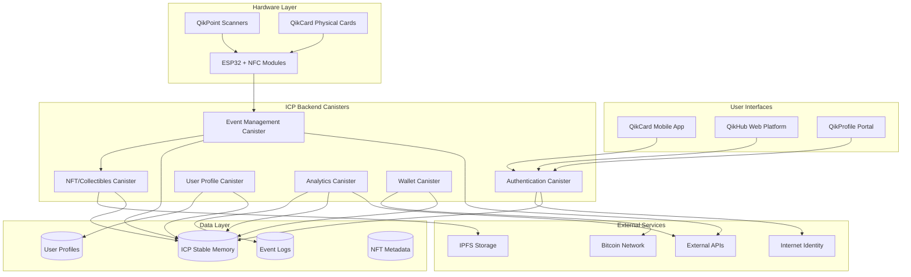

# QikCard Platform Architecture

## System Overview

QikCard Platform is a comprehensive Web3 event engagement system built on the Internet Computer Protocol (ICP), combining hardware NFC devices, mobile applications, and blockchain technology to create seamless event experiences.

## High-Level Architecture Diagram



## Component Interactions

### 1. User Authentication Flow
- Users authenticate via Internet Identity
- QikCard acts as hardware 2FA device
- t-ECDSA signatures for transaction authentication

### 2. Event Interaction Flow
- QikCard tapped on QikPoint scanner
- ESP32 reads NFC data and sends to Event Management Canister
- Real-time event logging and analytics
- Automatic NFT/collectible minting

### 3. Wallet Operations
- Secure key storage on QikCard hardware
- Transaction signing via NFC communication
- Bitcoin integration for cross-chain functionality

## Canister Architecture

### Authentication Canister (`auth_canister`)
```rust
// Core authentication logic
- Internet Identity integration
- Session management
- Access control
- Hardware device registration
```

### Event Management Canister (`event_canister`)
```rust
// Event lifecycle management
- Event creation and configuration
- QikPoint device management
- Real-time participant tracking
- Analytics and reporting
```

### NFT/Collectibles Canister (`nft_canister`)
```rust
// Digital collectibles system
- NFT minting and management
- Collectible metadata storage
- Reward distribution logic
- Marketplace functionality
```

### User Profile Canister (`profile_canister`)
```rust
// User data and preferences
- Profile information
- Achievement tracking
- Social networking features
- Privacy controls
```

### Analytics Canister (`analytics_canister`)
```rust
// Data analytics and insights
- Event performance metrics
- User engagement tracking
- Business intelligence
- Reporting dashboard
```

### Wallet Canister (`wallet_canister`)
```rust
// Blockchain wallet functionality
- Asset management
- Transaction processing
- Cross-chain integration
- Security protocols
```

## Hardware Architecture

### QikPoint Scanner Components
- **ESP32 Microcontroller**: Main processing unit
- **PN532 NFC Module**: NFC communication
- **WiFi Module**: Internet connectivity
- **Status LEDs**: Visual feedback
- **Buzzer**: Audio feedback
- **Power Management**: Battery/USB power

### QikCard Physical Structure
- **NFC Chip**: NTAG213/215/216
- **Secure Element**: Hardware wallet functionality
- **Custom PCB**: Integrated circuits
- **Durable Housing**: Event-ready design

## Network Architecture

### ICP Network Integration
- **Subnet Deployment**: Application subnets for scalability
- **Consensus**: ICP consensus mechanism
- **Storage**: Stable memory for persistence
- **Cycles**: Computation and storage costs

### External Integrations
- **Bitcoin Network**: Cross-chain functionality
- **IPFS**: Distributed file storage
- **External APIs**: Event data synchronization
- **CDN**: Global content delivery

## Security Architecture

### Multi-Layer Security
1. **Hardware Security**: Secure element in QikCard
2. **Network Security**: ICP's cryptographic guarantees
3. **Application Security**: Input validation and sanitization
4. **Access Control**: Role-based permissions
5. **Data Encryption**: End-to-end encryption

### Key Management
- **t-ECDSA**: Threshold cryptography for signing
- **Hardware Keys**: Secure key storage in QikCard
- **Session Keys**: Temporary authentication tokens
- **Recovery Mechanisms**: Account recovery protocols

## Scalability Considerations

### Horizontal Scaling
- **Multiple Canisters**: Load distribution across canisters
- **Subnet Utilization**: Leveraging ICP's subnet architecture
- **Caching Strategies**: Efficient data access patterns

### Performance Optimization
- **Batch Processing**: Efficient bulk operations
- **Lazy Loading**: On-demand data retrieval
- **Connection Pooling**: Optimized network usage

## Data Flow Architecture

### Event Data Pipeline
1. **Data Collection**: QikPoint scanners capture interactions
2. **Real-time Processing**: Immediate canister updates
3. **Analytics Processing**: Batch analytics computation
4. **Storage**: Persistent storage in stable memory
5. **Reporting**: Dashboard and API access

### User Journey Tracking
1. **Registration**: Account creation and KYC
2. **Device Pairing**: QikCard association
3. **Event Participation**: Interaction logging
4. **Reward Distribution**: Automated collectible minting
5. **Profile Updates**: Achievement and progress tracking

## Deployment Architecture

### Development Environment
- **Local Replica**: DFX local development
- **Testing Suite**: PocketIC integration tests
- **CI/CD Pipeline**: Automated testing and deployment

### Production Environment
- **Mainnet Deployment**: ICP mainnet canisters
- **Monitoring**: Health checks and alerting
- **Backup**: Data backup and recovery procedures
- **Updates**: Canister upgrade procedures

---

*This architecture is designed for scalability, security, and seamless user experience across all components of the QikCard ecosystem.*
