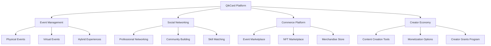

# QikCard Platform Future Plans & Roadmap

## Overview

QikCard Platform's post-WCHL 2025 development roadmap outlines our vision for becoming the leading Web3 event engagement platform, expanding into new markets, and pioneering innovative blockchain-based experiences.

## Short-term Goals (Q2-Q4 2025)

### Product Enhancement
- **Advanced Analytics Dashboard**
  - AI-powered engagement predictions
  - Custom report builder with drag-and-drop interface
  - Real-time sentiment analysis from event feedback
  - Predictive modeling for optimal event layouts

- **Enhanced Hardware Capabilities**
  - QikCard 2.0 with color e-ink display
  - Wireless charging capability
  - Extended battery life (30+ days)
  - Multi-frequency NFC support (13.56MHz + UHF)

- **Mobile Application**
  - Native iOS and Android apps
  - Offline-first architecture with sync capabilities
  - Augmented Reality (AR) venue navigation
  - Push notifications for personalized event recommendations

### Market Expansion
- **Geographic Rollout**
  - North America: Full deployment across major conference venues
  - Europe: Partnership with European event organizers
  - Asia-Pacific: Strategic partnerships in Singapore, Tokyo, Seoul

- **Vertical Integration**
  - Corporate training and team building
  - University campus events and orientations
  - Music festivals and entertainment venues
  - Trade shows and exhibitions

## Medium-term Vision (2026-2027)

### Technology Innovation

#### 1. AI-Powered Personalization
```typescript
// Future AI recommendation engine
interface PersonalizationEngine {
  generateRecommendations(
    userProfile: UserProfile,
    eventData: EventData,
    realTimeContext: ContextData
  ): Promise<PersonalizedExperience>;
  
  optimizeEventFlow(
    participantBehavior: BehaviorData[],
    venueLayout: VenueMap
  ): Promise<OptimizedLayout>;
}
```

#### 2. Cross-Chain Expansion
- **Multi-Blockchain Support**
  - Ethereum Layer 2 integration
  - Solana program development
  - Polygon network deployment
  - Cross-chain bridge implementation

- **DeFi Integration**
  - Event token staking mechanisms
  - Yield farming for premium features
  - NFT lending and borrowing
  - Decentralized event insurance

#### 3. Metaverse Integration
- **Virtual Event Spaces**
  - 3D event environments in popular metaverse platforms
  - NFT-gated virtual experiences
  - Hybrid physical-virtual event management
  - Avatar-based networking

### Platform Expansion

#### QikCard Ecosystem Growth


#### New Product Lines
- **QikCard Pro**: Enterprise-grade hardware with advanced security
- **QikCard Lite**: Cost-effective solution for smaller events
- **QikCard SDK**: Developer tools for third-party integrations

## Long-term Vision (2028-2030)

### Global Platform Transformation

#### 1. Universal Digital Identity
- **Cross-Platform Identity**
  - Single QikCard identity across all Web3 platforms
  - Verifiable credentials and certifications
  - Reputation scoring across different contexts
  - Privacy-preserving identity verification

#### 2. Smart City Integration
- **Urban Infrastructure**
  - Public transportation integration
  - Municipal service access
  - Civic engagement platforms
  - Emergency response systems

#### 3. Enterprise Solutions
```typescript
// Future enterprise integration
interface EnterpriseQikCard {
  employeeAccess: AccessControlSystem;
  complianceTracking: ComplianceManager;
  workflowAutomation: WorkflowEngine;
  reportingDashboard: AnalyticsPlatform;
}
```

### Research & Development Focus

#### Advanced Technologies
- **Quantum-Safe Cryptography**
  - Post-quantum cryptographic algorithms
  - Quantum key distribution
  - Quantum-resistant blockchain protocols

- **Biometric Integration**
  - Fingerprint authentication
  - Facial recognition systems
  - Voice pattern analysis
  - Multi-modal biometric fusion

- **Edge Computing**
  - Local processing for privacy
  - Reduced latency interactions
  - Offline-capable smart contracts
  - Distributed computing networks

## Business Model Evolution

### Revenue Stream Diversification

#### Subscription Tiers (2026)
| Tier | Price | Features | Target Market |
|------|-------|----------|---------------|
| **Community** | Free | Basic events, 100 participants | Small meetups |
| **Professional** | $299/month | Advanced analytics, 5K participants | Corporate events |
| **Enterprise** | $1,999/month | Custom integrations, unlimited scale | Large conferences |
| **Platform** | Custom | White-label solutions, API access | Technology partners |

#### New Revenue Sources
- **Data Insights**: Anonymized analytics for market research ($50M ARR by 2028)
- **Advertising Platform**: Targeted advertising within events ($25M ARR by 2028)
- **Financial Services**: DeFi products and crypto services ($100M ARR by 2030)
- **Licensing**: Technology licensing to competitors ($30M ARR by 2028)

### Market Projections
```
2025: $2.5M ARR (Current projection)
2026: $10M ARR (4x growth)
2027: $35M ARR (3.5x growth)
2028: $100M ARR (2.8x growth)
2029: $250M ARR (2.5x growth)
2030: $500M ARR (2x growth)
```

## Innovation Labs

### Experimental Projects

#### 1. Neural Interface Integration
- **Brain-Computer Interfaces**
  - Thought-based event navigation
  - Emotional state monitoring
  - Cognitive load optimization
  - Accessibility for disabilities

#### 2. Holographic Displays
- **3D Visualization**
  - Holographic event maps
  - Floating user interfaces
  - Gesture-based interactions
  - Immersive data visualization

#### 3. Drone Integration
- **Autonomous Event Management**
  - Crowd flow monitoring
  - Automated video coverage
  - Real-time security surveillance
  - Dynamic content delivery

## Sustainability Initiatives

### Environmental Responsibility
- **Carbon Neutral Events**
  - Carbon footprint tracking
  - Offset purchasing integration
  - Sustainable venue recommendations
  - Green transportation incentives

- **Circular Economy**
  - Hardware recycling programs
  - Modular device design
  - Upgrade rather than replace model
  - Biodegradable components research

### Social Impact
- **Digital Inclusion**
  - Free QikCard program for underserved communities
  - Accessibility features for disabled users
  - Multi-language support expansion
  - Digital literacy training programs

## Success Metrics & KPIs

### Platform Growth Targets
- **User Base**: 10M+ active users by 2028
- **Events**: 100K+ events managed annually by 2027
- **Hardware**: 50M+ QikCard devices distributed by 2030
- **Revenue**: $500M+ ARR by 2030

### Technology Milestones
- **Scalability**: Support 1M+ simultaneous users
- **Latency**: <100ms global response times
- **Uptime**: 99.99% platform availability
- **Security**: Zero critical security incidents

### Market Leadership
- **Market Share**: 25% of Web3 event management market
- **Brand Recognition**: Top 3 event technology brand
- **Partnership Network**: 1000+ strategic partners
- **Global Presence**: Operations in 50+ countries

## Strategic Partnerships

### Technology Partners
- **Blockchain Networks**: ICP, Ethereum, Solana partnerships
- **Cloud Providers**: Multi-cloud deployment strategy
- **Hardware Manufacturers**: Strategic hardware partnerships
- **AI/ML Platforms**: Advanced analytics partnerships

### Industry Partners
- **Event Organizers**: Global conference partnerships
- **Venue Partners**: Smart venue integrations
- **Corporate Clients**: Enterprise deployment partnerships
- **Educational Institutions**: Campus-wide implementations

### Investment Strategy
- **Series A (2025)**: $8M for product development and market expansion
- **Series B (2027)**: $25M for international expansion
- **Series C (2029)**: $75M for platform diversification
- **IPO Consideration (2031)**: Public market readiness assessment

## Education & Community

### Developer Ecosystem
- **QikCard University**: Comprehensive developer education
- **Hackathons**: Regular innovation competitions
- **Grant Programs**: $10M developer grant fund
- **Open Source**: Core platform components open-sourced

### Community Building
- **QikCard Ambassadors**: Global community program
- **User Conferences**: Annual QikCard Developer Conference
- **Documentation**: Comprehensive API and integration docs
- **Forums**: Active developer and user communities

## Emerging Opportunities

### Web3 Trends to Capitalize On
- **DAOs**: Decentralized event organization tools
- **Social Tokens**: Community-specific currencies
- **NFT Utilities**: Beyond collectibles to functional assets
- **Zero-Knowledge**: Privacy-preserving interactions

### Technology Convergence
- **IoT Integration**: Smart city and venue connectivity
- **5G Networks**: Ultra-low latency applications
- **Edge Computing**: Distributed processing capabilities
- **Quantum Computing**: Advanced cryptography and optimization

---

## Call to Action

QikCard Platform's future is built on continuous innovation, strategic partnerships, and unwavering commitment to transforming how people connect and engage at events. Our roadmap positions us to become the defining platform of the Web3 event economy.

**Join us in building the future of events.**

*Ready to be part of the QikCard revolution? Contact our team at future@thetheqikcard.com*

---

*This roadmap represents our current vision and may evolve based on market conditions, technological advances, and community feedback. Last updated: January 2025*
