# 🔄 QikCard Platform User Flow Diagrams

## Overview

This document outlines the complete user journey through the QikCard Platform, from initial registration to advanced features usage.

## 🎯 Primary User Flows

### 1. User Onboarding Flow

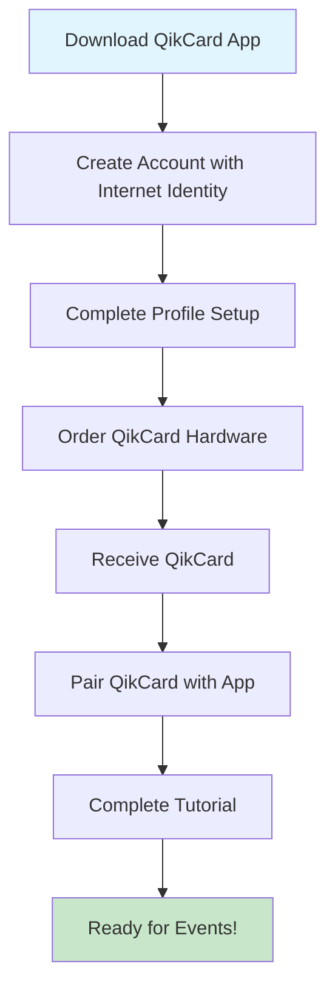

### 2. Event Participation Flow

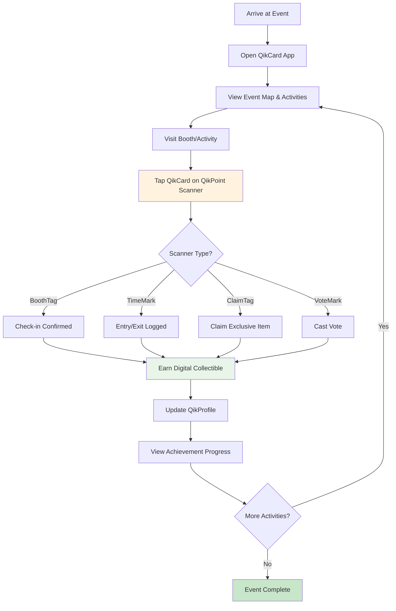

### 3. Wallet Operations Flow

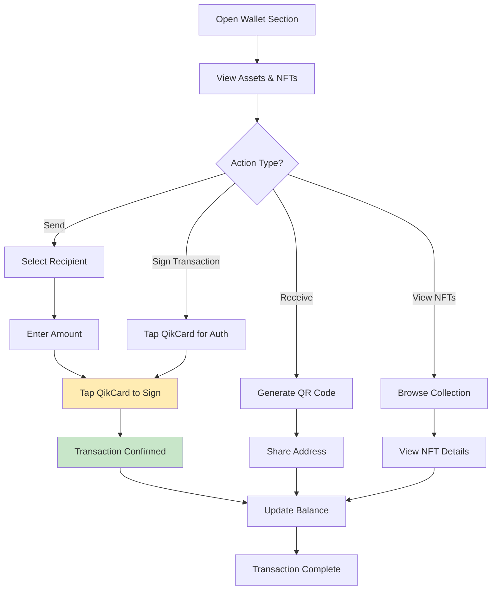

### 4. Social/Community Flow

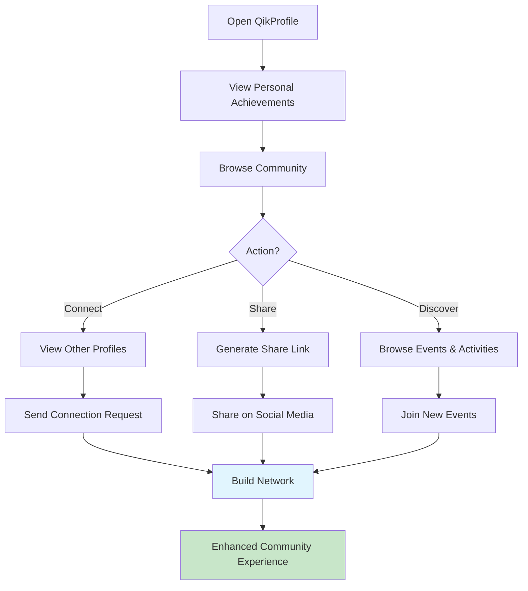

## 🏢 Event Organizer Flow

### Event Setup & Management

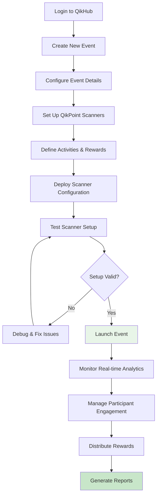

## 🔧 Hardware Interaction Flows

### QikPoint Scanner Interaction

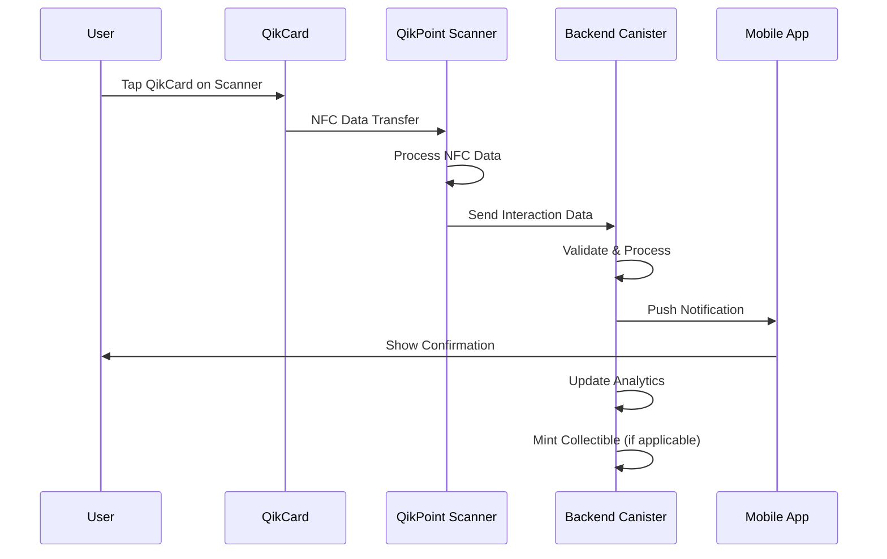

### QikCard Wallet Authentication

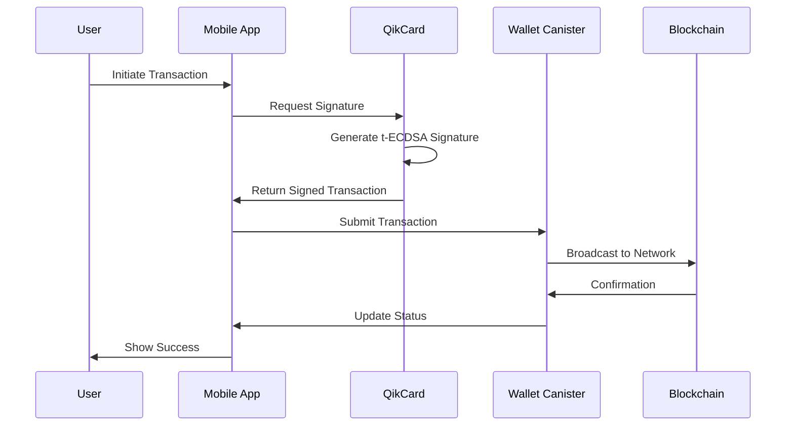

## 📱 Mobile App Navigation Flow

### Main App Structure

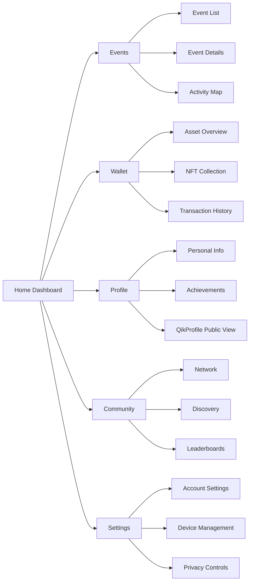

## 🎮 Gamification Flow

### Achievement & Reward System

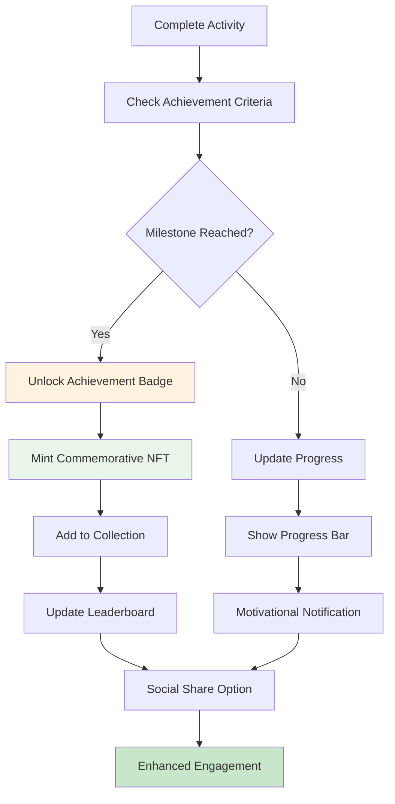

## 🔄 Cross-Platform Synchronization

### Data Sync Flow

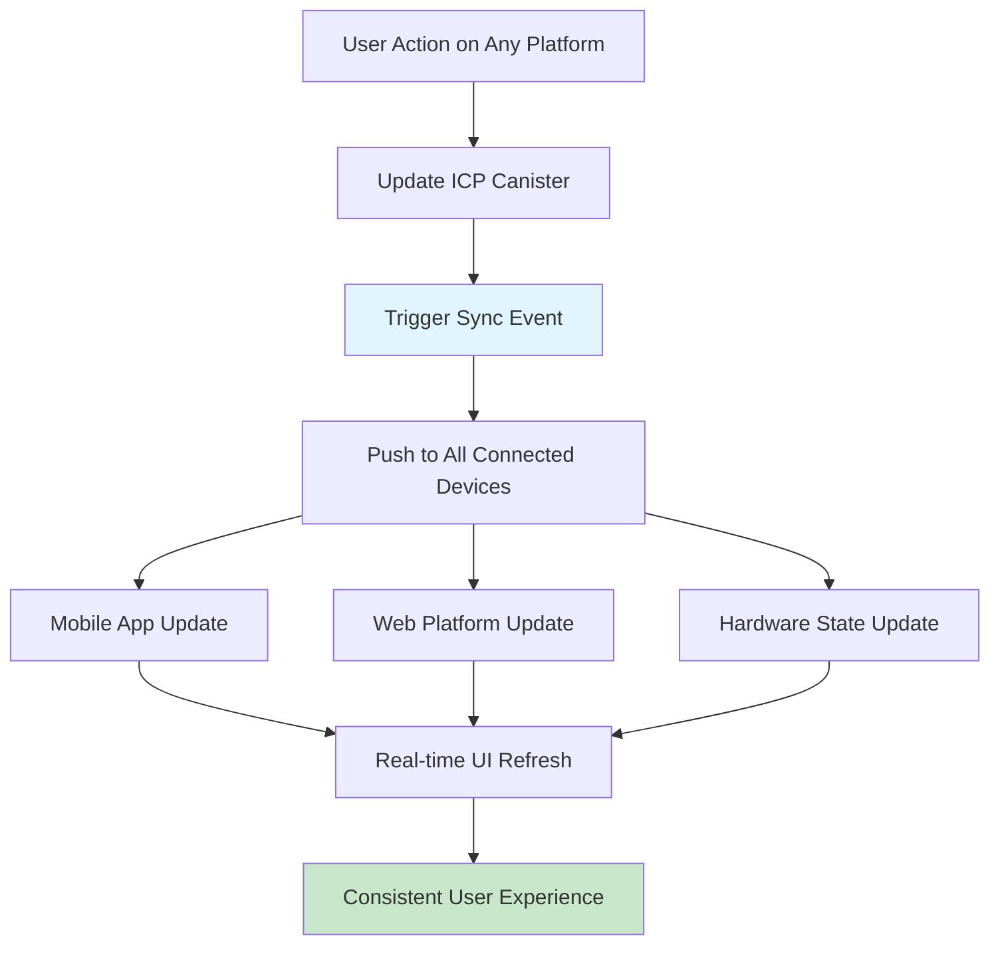

## 📊 Analytics & Reporting Flow

### Real-time Data Pipeline

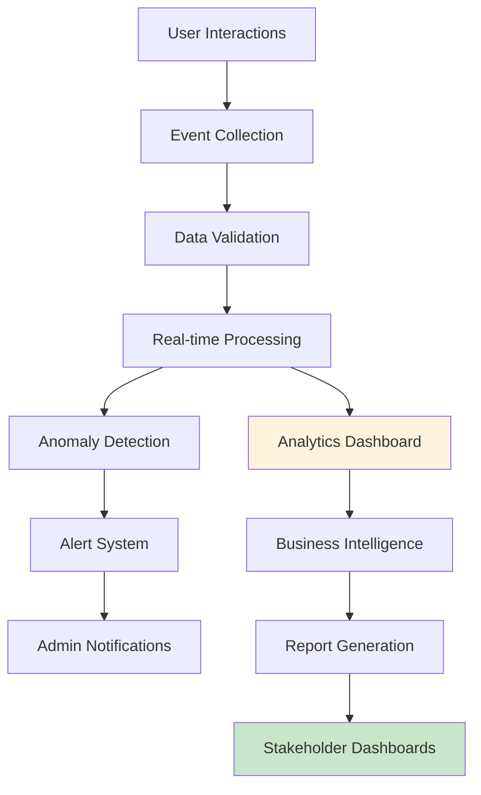

---

*These user flows ensure an intuitive, engaging, and seamless experience across all touchpoints of the QikCard Platform ecosystem.*
